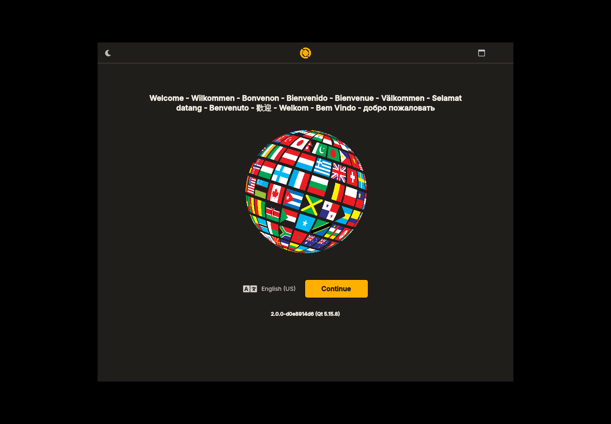
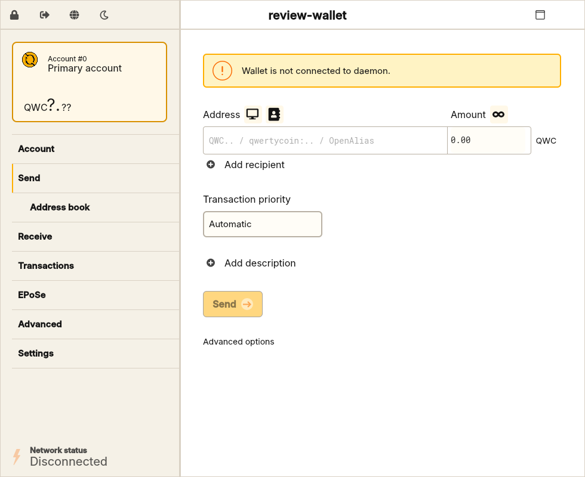
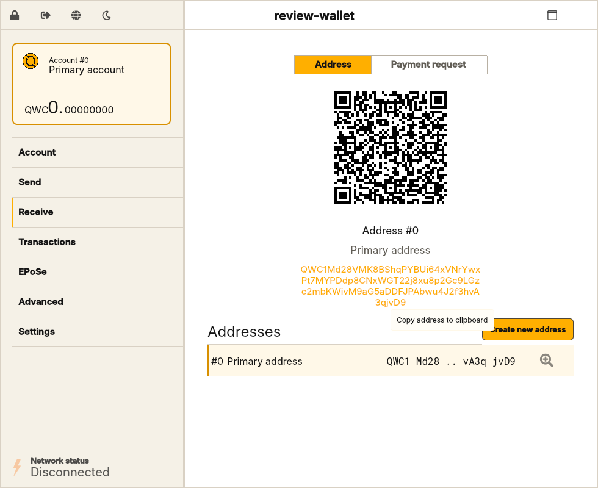
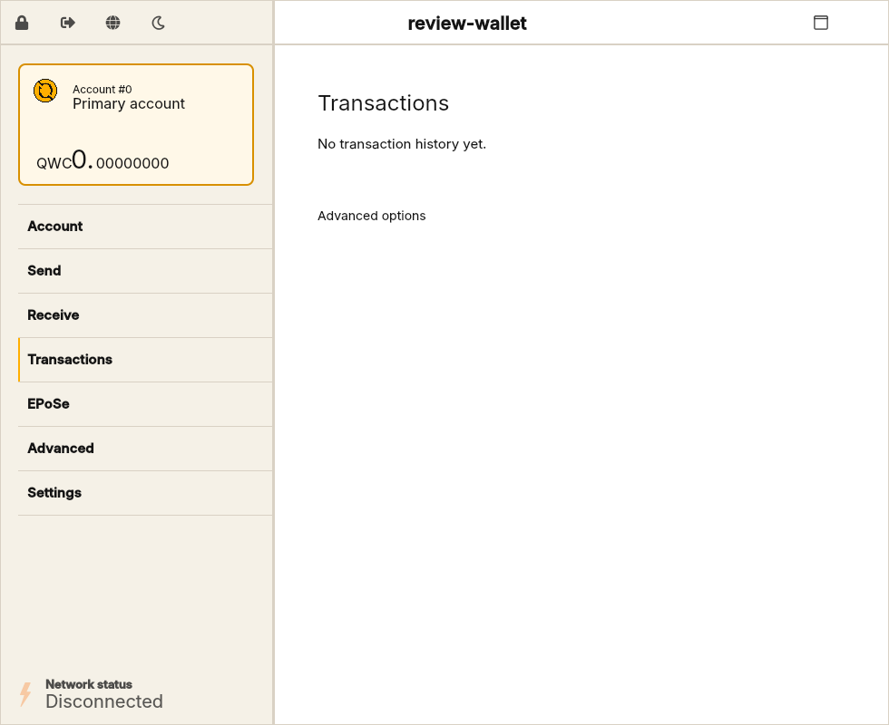
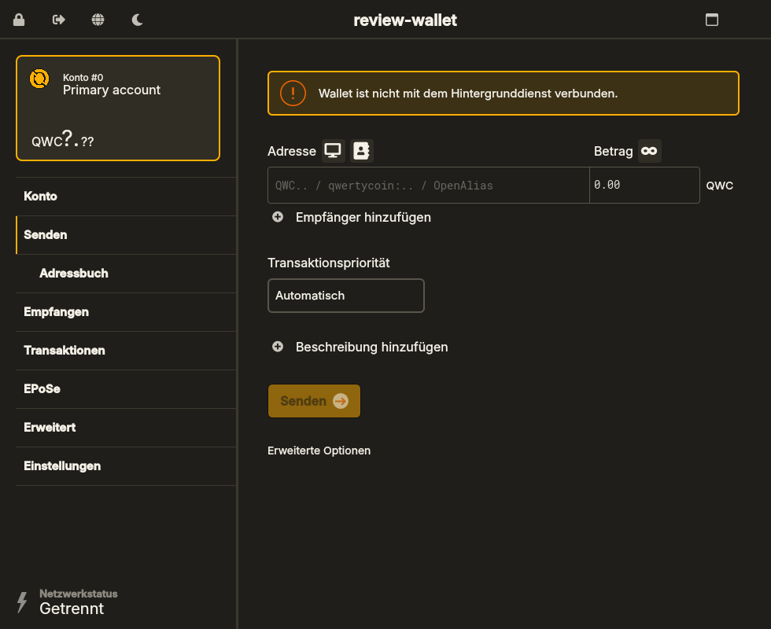
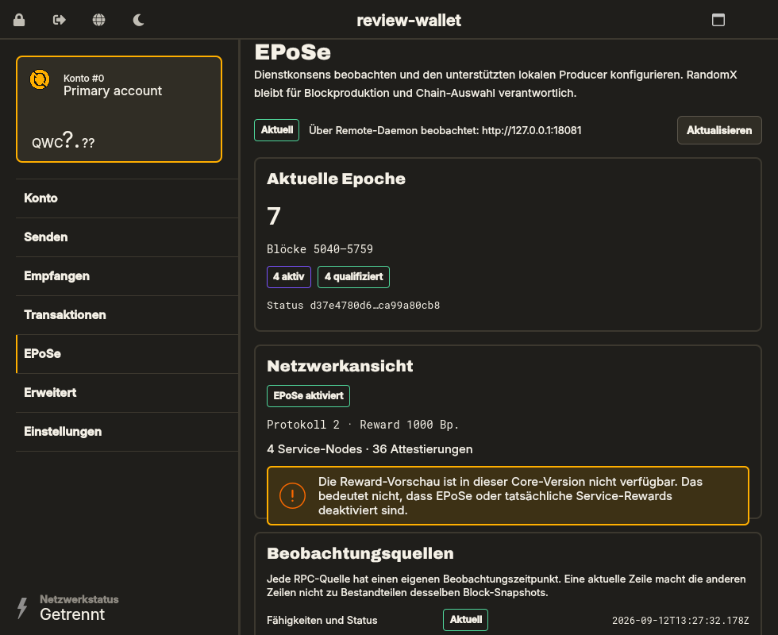

# Qwertycoin GUI review evidence

Review date: 2026-09-12 UTC

This document records local review evidence for the GUI modernization branch.
It is not a release attestation. No GitHub-hosted workflows, release tags,
codesigning, notarization or public packages were used.

## Source and network binding

| Item | Reviewed value |
| --- | --- |
| GUI baseline | `25719fb7ab08af5465b1ce4d7a51208bcf9a1e8b` |
| GUI implementation | `ac9acf5` (`feat: modernize QWC GUI and integrate EPoSe`) |
| Pinned Core Gitlink | `09086f7dbaaf1a4ff16bddeaa1d729f9ff65eca6` |
| Final Core mainnet ancestor | `e6e0b46b6603bc5c1402df63696b514ba735f8ee` |
| Mainnet genesis | `906629482787e94cb00463696a0e95ec75a480da09257c6270c65ba1a74a76b0` |
| EPoSe parameter hash | `e5654b4f5fa27faa51a80ca1e93bb877c3bd3345d0a803b6e7ab55c05189c20d` |

`tools/check_core_pin.sh` passed before and after builds. The submodule SHA did
not change. All acceptance configurations used `MANUAL_SUBMODULES=1` and
`DEV_MODE=OFF`.

## Linux environment

- Debian 12 (bookworm), Linux x86_64;
- GCC 12.2.0;
- CMake 3.25.1 and Ninja 1.11.1;
- Qt 5.15.8 dynamic review prefix;
- ccache enabled;
- software rendering/Xvfb used for headless functional checks;
- real rendered desktop windows inspected at 980x800 and a smaller supported
  window, in light/dark and English/German states.

Clean review configuration:

```sh
tools/check_core_pin.sh
cmake -S . -B build/gui-final-clean -G Ninja \
  -DCMAKE_BUILD_TYPE=RelWithDebInfo \
  -DCMAKE_PREFIX_PATH=/path/to/qt-5.15-prefix \
  -DCMAKE_C_COMPILER_LAUNCHER=ccache \
  -DCMAKE_CXX_COMPILER_LAUNCHER=ccache \
  -DCMAKE_C_FLAGS_RELWITHDEBINFO='-O1 -g1 -DNDEBUG' \
  -DCMAKE_CXX_FLAGS_RELWITHDEBINFO='-O1 -g1 -DNDEBUG' \
  -DSTATIC=OFF \
  -DMANUAL_SUBMODULES=1 \
  -DDEV_MODE=OFF \
  -DWITH_UPDATER=OFF \
  -DUSE_DEVICE_TREZOR=OFF \
  -DQML_TESTS=ON
cmake --build build/gui-final-clean \
  --target qwertycoin-gui qwertycoin-gui-epose-tests \
           simplewallet wallet_rpc_server \
  --parallel 1
tools/check_core_pin.sh
```

The lower optimization/debug-info profile kept the review build inside the
available RAM envelope; it does not alter consensus constants or source.
An initial `--parallel 2` invocation was terminated by the Linux OOM killer
while compiling `core_rpc_server.cpp`. There was no compiler or source error;
the same configured build tree completed all 197 targets with `--parallel 1`.

## Test results

| Check | Result |
| --- | --- |
| Pinned Core EPoSe unit binary | 238/238 passed, 121.037 s |
| GUI EPoSe adapter/producer integration tests | 8/8 passed |
| CTest discovery | `qwertycoin-gui-epose-tests` discovered and passed 1/1 |
| QML functional suite | 18/18 passed, including bundled FontLoader status, square title-bar logo rendering and amount-before-currency wallet summary geometry |
| QML scale-factor matrix | 18/18 at 100%, 125%, 150% and 200% |
| Updated German catalog | 968/968 meaningful messages translated; one intentional empty spacer |
| Offline fixed-seed restore smoke | Passed twice with the same public test address |
| Isolated create/send regtest | Two new wallets; 1 QWC sent, confirmed and recipient balance verified |
| Runtime package content/hashes | 882 files; all manifest SHA-256 entries verified |
| Native icon regeneration | Second local generation was byte-identical for every PNG, ICO and ICNS output |
| Bundled font assets | Inter/Archivo identified as valid OpenType; licenses present; Qt FontLoader status tested |
| Key text contrast | 5.81:1 minimum for reviewed normal secondary text; gold action text 9.99:1 |
| Current QWC v2 daemon contract sanity | Read-only `get_epose_info` returned OK, protocol 2 and 1000 reward basis points |

Core suite invocation used the test binary built directly from the exact
`qwertycoin/` Gitlink. GUI checks use:

```sh
build/gui-final-clean/bin/qwertycoin-gui-epose-tests -txt
Xvfb :99 -screen 0 1440x1000x24 &
DISPLAY=:99 QT_QUICK_BACKEND=software \
  build/gui-final-clean/bin/qwertycoin-gui --test-qml
tools/smoke/restore_from_seed.sh \
  build/gui-final-clean/bin/qwertycoin-wallet-cli
tools/smoke/create_send_regtest.py build/gui-final-clean
```

The create/send smoke runs a new offline regtest daemon and disposable wallet
RPC processes. It never connects to mainnet, never uses funded wallets and
does not print seeds or private keys.

The EPoSe adapter tests cover invalid endpoints, unauthorized and unsupported
responses, timeout, incomplete responses, list truncation, exact large integer
transport, daemon-generation changes, retired legacy registration semantics,
unavailable reward preview, producer argument validation and keystore handling.

## Package review

The local Linux review package includes:

- `qwertycoin-gui`, the exact pinned `qwertycoind`, wallet CLI and wallet RPC;
- Qt platform, SVG/image format and required QML runtime modules;
- bundled Inter/Archivo fonts and their licenses;
- Q mark, wordmark, application icon sizes, `qt.conf`, README and licenses.

The review package is dynamic and unsigned. The `QML_TESTS=ON` review binary
also links Qt QuickTest; the final release configuration must use
`QML_TESTS=OFF` and complete the native platform packaging gate.

## Screenshots

All screenshots use disposable local wallet data. No seed, private key,
credential or private infrastructure address is included.

| View | Evidence |
| --- | --- |
| Wizard, dark, English |  |
| Transfer, light, English |  |
| Receive, light, English |  |
| History, light, English |  |
| Transfer, dark, German |  |
| EPoSe, dark, German |  |

The EPoSe screenshot uses a deterministic local read-only RPC fixture to show
the complete active/qualified/attestation states. Its values are presentation
test data and are not represented as a live mainnet snapshot.

## Platform and release limits

- No connected native macOS Apple Silicon or Windows x86_64 machine was
  available. Their paths received static review only; no native pass is claimed.
- Linux packages are unsigned review artifacts.
- Codesigning, macOS notarization, updater metadata and publication are outside
  this branch and remain release gates.
- Hardware wallets, inherited P2Pool launch/download, fiat feeds and automatic
  updates remain fail-closed pending dedicated QWC validation.
- Workflow templates remain exclusively in `.github/workflows-disabled/`.
  No GitHub-hosted workflow was started for this work.
